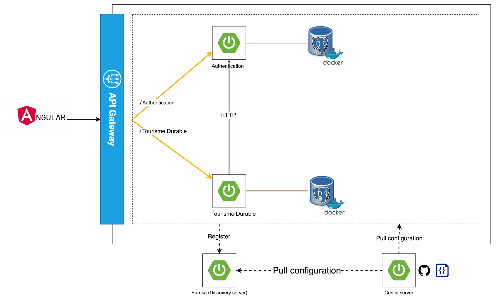

# Microservices Project

Ce repository  contient un projet de démonstration présentant une application basée sur une architecture de microservices, conçue pour offrir une compréhension pratique de l'architecture et de la mise en œuvre des microservices. Le projet comprend une passerelle API, un serveur de configuration, un serveur de découverte et deux microservices : Authentification et Tourisme-Durable.

## Architecture



## Table of Contents

- [Getting Started](#getting-started)
    - [Prerequisites](#prerequisites)
    - [Installation](#installation)
- [Project Components](#project-components)
    - [Angular Frontend](#angular-frontend)
    - [API Gateway](#api-gateway)
    - [Config Server](#config-server)
    - [Discovery Server](#discovery-server)
    - [Authentification Microservice](#A=authentification-microservice)
    - [Tourisme-Durable Microservice](#tourisme-durable-microservice)
- [Inter-Service Communication](#inter-service-communication)
    - [Using OpenFeign](#using-openfeign)
- [Distributed Tracing](#distributed-tracing)
    - [Using Zipkin](#using-zipkin)
- [Contributing](#contributing)
- [License](#license)
- [Contact](#contact)
- [Acknowledgements](#acknowledgements)

## Getting Started

Follow the instructions below to set up the project on your local machine for development and testing purposes.

### Prerequisites

Ensure you have the following software installed on your system before proceeding:

- Java Development Kit (JDK) 21 or later
- Maven
- Git
- IntelliJ IDEA (recommended, but not required)
- Postman (optional, for testing the API endpoints)
- Postgres 
- Angular Cli 17 or later
- Node 20 or later
- Docker (optional, for containerization)

### Installation

1. Clone the repository:

```git clone git remote add origin git@github.com:ali-bouali/springboot-3-micro-service-demo.git```

2. Navigate to the project directory:
3. Build and package each component with Maven and for frontend run npm install and ng serve:


## Project Components

### Angular Frontend

The Angular Frontend is a single-page application (SPA) that consumes the microservices' RESTful APIs, providing a user-friendly interface for interacting with the application.

### API Gateway

The API Gateway serves as the single entry point for all client requests, managing and routing them to the appropriate microservices.

### Config Server

The Config Server centralizes configuration management for all microservices, simplifying application maintenance and consistency across environments.

### Discovery Server

The Discovery Server provides service registration and discovery, enabling seamless service-to-service communication within the microservices ecosystem.

### Auth Microservice

The Auth Microservice is responsible for user authentication and authorization, including user registration, login, and logout.

### Tourisme Durable Microservice

The Tourisme Durable Microservice manages school-related data and operations, including adding, updating, and retrieving balades ( en francais ) records.

## Inter-Service Communication

### Using OpenFeign

This project demonstrates inter-service communication using OpenFeign, a declarative REST client that simplifies service-to-service communication within the microservices ecosystem.

## Distributed Tracing

### Using Zipkin

The project showcases the use of Zipkin for distributed tracing, enhancing application observability and enabling the visualization and troubleshooting of latency issues.

## Contributing

Contributions are welcome! Please read our [CONTRIBUTING.md](CONTRIBUTING.md) for details on how to contribute to this project.

## License

This project is licensed under the [MIT License](LICENSE).

## Acknowledgements

- [OpenFeign](https://github.com/OpenFeign/feign)
- [Zipkin](https://zipkin.io/)
- [Spring Cloud Netflix](https://spring.io/projects/spring-cloud-netflix)
